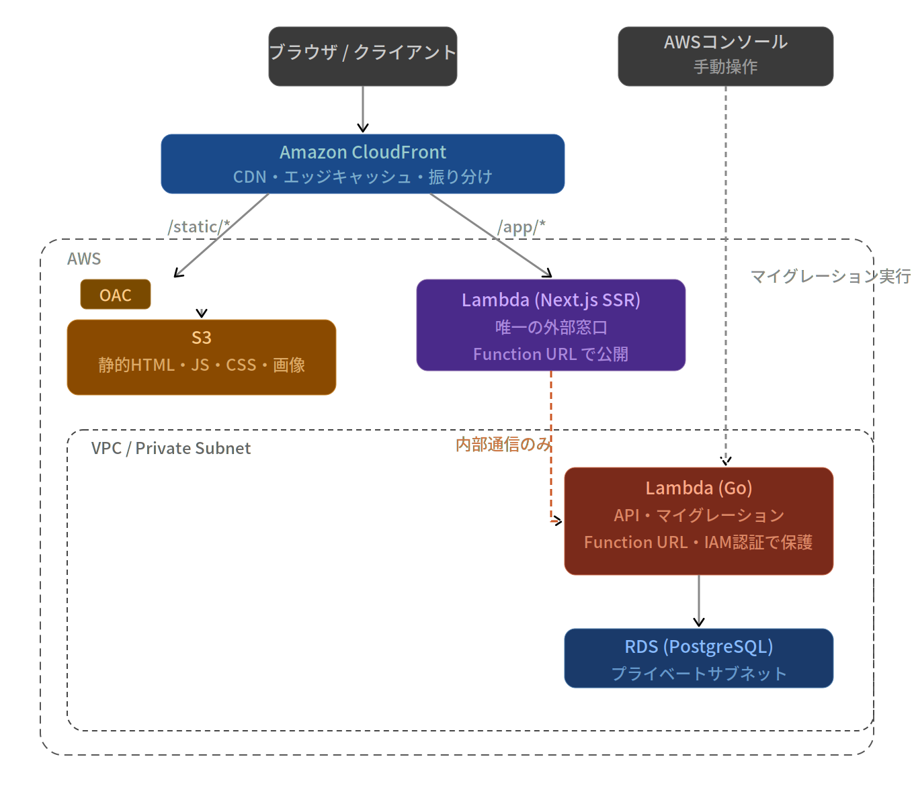

# VeganBite - Vegan Food Review Website

ビーガン食品に特化した口コミ・レビューサイトです。ユーザーが商品を評価・レビューし、お気に入りを管理できます。

## 💡 About

- **目的**: ビーガン食品の情報を集約し、消費者の商品選びをサポート
- **収益モデル**: アフィリエイト広告（Amazon、楽天、Yahoo!ショッピング）による収益化
- **ターゲット**: ビーガン・ベジタリアン、健康志向の消費者

## 🌐 Live Site

- **サイト**: https://dq02ue4hf290k.cloudfront.net
- **管理画面**: https://dq02ue4hf290k.cloudfront.net/admin

## 🎬 Demo

### 管理画面：商品作成


### 管理画面：カテゴリー追加


### 管理画面：レビュー管理


### 管理画面：カスタマー管理


## Tech Stack

### Frontend
- Next.js 15 (App Router)
- React 19 + TypeScript 5.9
- Tailwind CSS v4
- Jest + Testing Library

### Backend
- Go 1.25
- Echo framework
- GORM
- PostgreSQL 18
- Google OAuth 2.0 + JWT

### Infrastructure
- AWS Lambda (Go API + Next.js SSR)
- Amazon CloudFront (CDN)
- Amazon S3 (静的アセット)
- Amazon RDS (PostgreSQL)
- Amazon VPC (プライベートネットワーク)
- Terraform (Infrastructure as Code)
- GitHub Actions (CI/CD)
- Docker & Docker Compose (ローカル開発)

## AWS Architecture



### セキュリティ

- **S3**: OAC（Origin Access Control）で保護。CloudFront経由のみアクセス可
- **Go Lambda**: Function URL を AWS_IAM 認証で保護。Next.js Lambda からのみ呼び出し可
- **RDS**: プライベートサブネットに配置。Go Lambda のセキュリティグループからのみ接続可
- **外部からGoのAPIへの直接アクセスは不可**。全てNext.js Lambdaを経由

## CI/CD

### PRを出したとき（ci.yml）
- フロントエンド: ESLint + TypeScript型チェック + Jest テスト
- バックエンド: golangci-lint + Go テスト

### mainにマージしたとき（deploy.yml）
- フロントエンド: OpenNext ビルド → S3に静的ファイルアップロード → Lambda更新 → CloudFrontキャッシュクリア
- バックエンド: Go ビルド → Lambda更新

## Architecture

バックエンドはクリーンアーキテクチャとドメイン駆動設計（DDD）を採用しています。

- ビジネスロジックをエンティティやバリューオブジェクトに分離し、再利用可能で一貫性のある設計を実現
- ユビキタス言語を導入してドメインエキスパートと共通の言語で要件を整理し、システム全体の設計を効率化
- 依存性の方向を外側から内側へ（Handler → UseCase → Domain）統一し、テスタビリティと柔軟性を確保

```
interfaces/     → usecase/     → domain/
(Handler,DTO)    (Business)     (Entity,ValueObject,Repository)
                      ↓
               infrastructure/
               (DB,OAuth,JWT)
```

## Getting Started

### Prerequisites
- Docker Desktop installed and running
- Git

### Setup

1. Clone the repository
```bash
git clone <repository-url>
cd VeganBite
```

2. Copy environment file and configure
```bash
cp .env.example .env
```

Edit `.env` with your Google OAuth credentials:
```
GOOGLE_CLIENT_ID=your-client-id.apps.googleusercontent.com
GOOGLE_CLIENT_SECRET=your-client-secret
JWT_SECRET=your-jwt-secret-key
DB_SSLMODE=disable
```

3. Build and start containers
```bash
docker compose build
docker compose up -d
```

4. Run migrations
```bash
docker compose exec backend migrate -path ./migrations -database "postgres://postgres:postgres@db:5432/veganbite?sslmode=disable" up
```

5. Access the application
- Frontend: http://localhost:3000
- Backend API: http://localhost:8080
- Admin: http://localhost:3000/admin/login

### Google OAuth Setup

1. Go to [Google Cloud Console](https://console.cloud.google.com/)
2. Create a new project
3. Enable OAuth consent screen
4. Create OAuth 2.0 credentials
5. Add authorized redirect URIs:
   - `http://localhost:8080/api/auth/google/callback`
   - `http://localhost:8080/api/auth/admin/google/callback`

## Project Structure

```
VeganBite/
├── frontend/                 # Next.js frontend
│   ├── src/
│   │   ├── api/             # API client functions
│   │   │   ├── admin/       # Admin API calls
│   │   │   ├── auth/        # Auth API calls
│   │   │   ├── customer/    # Customer API calls
│   │   │   ├── config.ts    # API設定（SSR/CSR振り分け）
│   │   │   └── lambda-client.ts  # AWS SDK Lambda呼び出し
│   │   ├── app/             # Next.js App Router pages
│   │   │   ├── admin/       # Admin pages
│   │   │   ├── auth/        # Auth callback
│   │   │   ├── api/         # API Route（Go Lambdaへの中継）
│   │   │   └── ...
│   │   ├── components/      # UI components
│   │   │   ├── admin/       # Admin components
│   │   │   ├── auth/        # Auth guards
│   │   │   ├── common/      # Shared components
│   │   │   └── customer/    # Customer components
│   │   └── contexts/        # React Context
│   ├── open-next.config.ts  # OpenNext設定
│   ├── Dockerfile
│   └── package.json
├── backend/                  # Go backend (Clean Architecture)
│   ├── cmd/lambda/          # Lambda用エントリポイント
│   ├── server/              # Echo設定（共通）
│   ├── config/              # Configuration
│   ├── domain/              # Entities, Repository interfaces
│   │   ├── admin/
│   │   ├── customer/
│   │   ├── product/
│   │   ├── review/
│   │   └── favorite/
│   ├── usecase/             # Business logic
│   │   ├── admin/
│   │   └── customer/
│   ├── infrastructure/      # DB implementation, external APIs
│   │   ├── auth/            # JWT, OAuth services
│   │   └── persistence/     # Repository implementations
│   ├── interfaces/          # Handlers, DTOs
│   │   ├── dto/
│   │   └── handler/
│   │       ├── admin/
│   │       └── customer/
│   ├── migrations/          # SQL migrations
│   ├── main.go              # ローカル開発用エントリポイント
│   ├── Dockerfile
│   └── go.mod
├── terraform/               # Infrastructure as Code
│   ├── environments/dev/    # Dev環境設定
│   └── modules/
│       ├── vpc/             # VPC, サブネット, NAT Gateway
│       ├── rds/             # PostgreSQL
│       ├── lambda-backend/  # Go API Lambda
│       ├── lambda-frontend/ # Next.js Lambda + S3
│       └── cloudfront/      # CDN
├── .github/workflows/       # CI/CD
│   ├── ci.yml               # PR時のテスト
│   └── deploy.yml           # mainマージ時のデプロイ
├── docker-compose.yml
└── README.md
```

## Database

### Current Tables (8)
- `admins` - 管理者
- `admin_roles` - 管理者ロール
- `customers` - 一般ユーザー
- `categories` - カテゴリ
- `products` - 商品
- `product_categories` - 商品とカテゴリの中間テーブル
- `reviews` - レビュー
- `favorites` - お気に入り

## Pages

### Customer Pages
- `/` - Product listing
- `/product/:id` - Product detail with reviews
- `/login` - Customer login
- `/mypage` - Customer profile, reviews, favorites
- `/terms` - Terms of service
- `/privacy` - Privacy policy

### Admin Pages
- `/admin/login` - Admin login
- `/admin/products` - Product management
- `/admin/products/new` - Add new product
- `/admin/products/:id/edit` - Edit product
- `/admin/categories` - Category management
- `/admin/categories/new` - Add new category
- `/admin/categories/:id/edit` - Edit category
- `/admin/reviews` - Review management
- `/admin/customers` - Customer management (BAN/suspend)

## API Endpoints

### Authentication
| Method | Endpoint | Description |
|--------|----------|-------------|
| GET | /api/auth/google | Customer Google OAuth login |
| GET | /api/auth/google/callback | Customer OAuth callback |
| GET | /api/auth/admin/google | Admin Google OAuth login |
| GET | /api/auth/admin/google/callback | Admin OAuth callback |
| GET | /api/auth/me | Get current user (Protected) |
| POST | /api/auth/logout | Logout (Protected) |

### Public Endpoints
| Method | Endpoint | Description |
|--------|----------|-------------|
| GET | /api/health | Health check |
| GET | /api/categories | List categories |
| GET | /api/products | List products |
| GET | /api/products/:id | Get product |
| GET | /api/products/:id/reviews | List product reviews |

### Protected Endpoints (Admin)
| Method | Endpoint | Description |
|--------|----------|-------------|
| POST | /api/products | Create product |
| PUT | /api/products/:id | Update product |
| DELETE | /api/products/:id | Delete product |
| POST | /api/categories | Create category |
| PUT | /api/categories/:id | Update category |
| DELETE | /api/categories/:id | Delete category |
| GET | /api/reviews | List all reviews |
| GET | /api/admin/customers | List all customers |
| POST | /api/admin/customers/:id/ban | Ban customer |
| POST | /api/admin/customers/:id/suspend | Suspend customer |
| POST | /api/admin/customers/:id/unban | Unban customer |

### Protected Endpoints (Customer)
| Method | Endpoint | Description |
|--------|----------|-------------|
| POST | /api/products/:id/reviews | Create review |
| PUT | /api/reviews/:id | Update review |
| DELETE | /api/reviews/:id | Delete review |
| GET | /api/customers/:id/favorites | List customer favorites |
| POST | /api/customers/:id/favorites | Add favorite |
| DELETE | /api/customers/:id/favorites/:productId | Remove favorite |
| GET | /api/customers/:id/reviews | List customer reviews |

### Migration (Manual)
| Method | Endpoint | Description |
|--------|----------|-------------|
| GET | /api/migrate | Run database migrations (AWS Console only) |

## License

MIT
